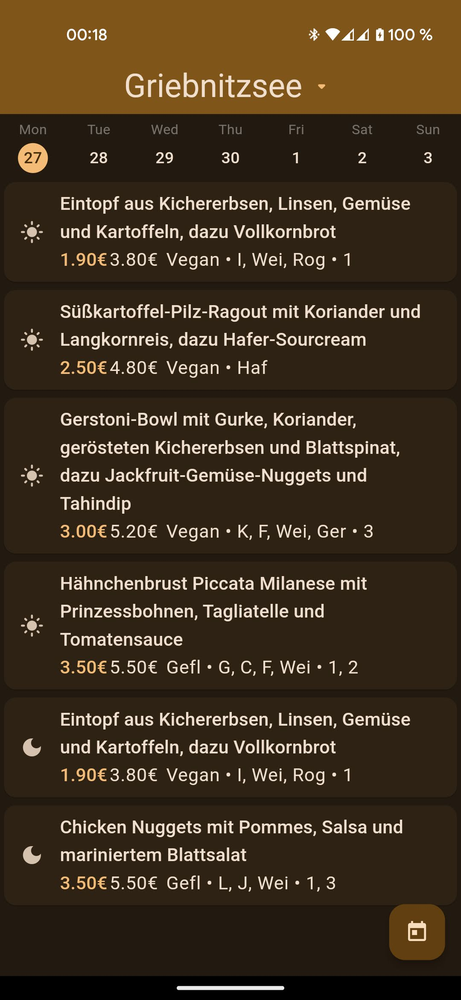
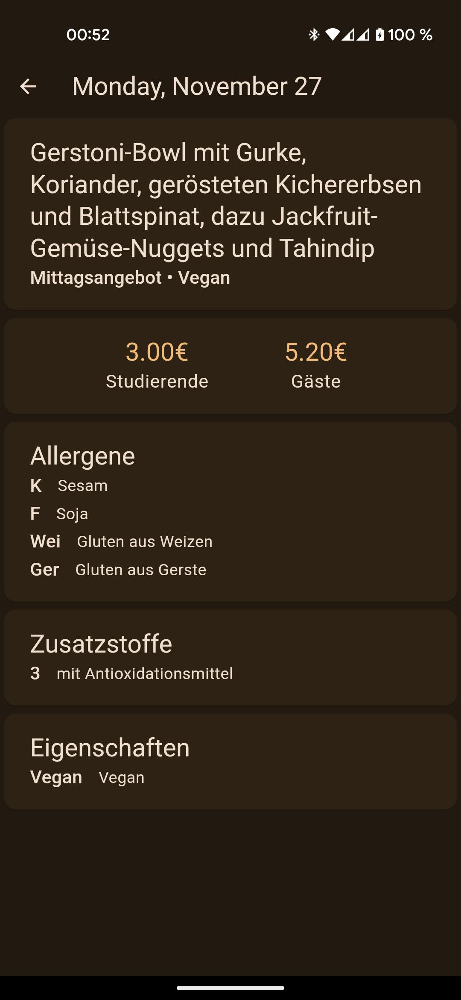

#

    <h1>micro-mensa</h1>
    A lightweight mensa application for use with the <a href="https://github.com/dasGoogle/webspeiseplan-api">webspeiseplan-api</a> project.
    <table>
<tr>
<td></td>
<td></tr>
</table>

The app is still in a very early beta stage but prebuilt APKs are available on the releases page.

The app can currently be compiled for Android and Linux, but it should also be possible to compile it for iOS and other platforms.
